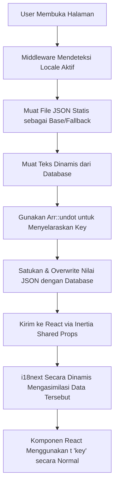

# Rencana Implementasi: Manajemen Copywriting Dinamis via Filament Admin Panel

Dokumen ini menjelaskan rancangan arsitektur, langkah-langkah teknis, jaminan keamanan (security), dan **Strategi Migrasi Seamless** untuk memindahkan teks/copywriting website Jissho dari file JSON statis ke database yang dikelola via **Filament PHP** dan dirender menggunakan **Inertia.js + React**.

---

## 1. Strategi Migrasi Seamless (Tanpa Downtime / Kerusakan Tampilan)

Untuk memastikan transisi berjalan mulus tanpa mengganggu jalannya aplikasi dan tanpa perlu menulis ulang pemanggilan terjemahan di ratusan komponen React, kita akan menggunakan metode **Hybrid Translation Loading (JSON + Database)**.



### Keuntungan Strategi Ini:
1.  **Zero-Code Changes di React:** Komponen React tetap menggunakan fungsi standar `{t("hero.landing.title")}` tanpa ada perubahan sama sekali.
2.  **Fallback Aman:** Jika suatu kunci (*key*) belum dimasukkan ke database, sistem akan otomatis menggunakan nilai bawaan yang ada di file `common.json` saat ini.
3.  **Transisi Bertahap:** Anda bisa memindahkan teks satu per satu atau sekaligus ke database. Aplikasi tidak akan pernah menampilkan teks kosong atau error.

---

## 2. Jaminan Keamanan & Validasi (Security Review)

Rancangan ini telah ditinjau dan dirancang dengan standar keamanan Laravel & Filament sebagai berikut:

1.  **Otorisasi Ketat (Role-Based Access Control):**
    *   Pengelolaan copywriting dilindungi oleh `SiteSettingPolicy` menggunakan **Spatie Laravel Permission**.
    *   Hanya pengguna dengan Role `Admin` yang diizinkan untuk melihat, mengubah, atau memperbarui pengaturan.
2.  **Perlindungan XSS (Cross-Site Scripting):**
    *   React secara default merender teks dinamis `{t('key')}` sebagai text node biasa (otomatis lolos HTML escape).
    *   Jika di masa depan diperlukan format HTML khusus (misalnya text tebal/italic), kita akan menggunakan Rich Editor dan membersihkannya di backend menggunakan sanitasi HTML sebelum disimpan.
3.  **Proteksi SQL Injection:**
    *   Semua interaksi database menggunakan Eloquent ORM dengan kueri berparameter (*parameterized queries*).
4.  **Manajemen Cache & Proteksi Kinerja (DOS Protection):**
    *   Data copywriting disimpan di sistem cache Laravel. Ini mencegah website melakukan kueri database berulang di setiap request pengunjung.
    *   Cache dibersihkan secara otomatis hanya ketika ada aksi penyimpanan data di panel admin melalui model event `saved()`.

---

## 3. Struktur Database

Kita akan membuat tabel baru bernama `site_settings` untuk menampung teks yang dinamis. 

### Skema Tabel `site_settings`
Tabel ini akan menyimpan nilai dinamis dalam bentuk JSON translatable (`{"id": "...", "en": "...", "ja": "..."}`) memanfaatkan fitur bawaan Laravel.

| Nama Kolom | Tipe Data | Deskripsi | Contoh |
| :--- | :--- | :--- | :--- |
| `id` | `BIGINT (PK)` | Auto increment ID | `1` |
| `group` | `VARCHAR` | Pengelompokan bagian web | `"hero"`, `"about"`, `"keunggulan"` |
| `key` | `VARCHAR (Unique)`| Kunci identitas teks | `"hero.landing.title"` |
| `value` | `JSON` | Nilai teks multi-bahasa | `{"id": "Wujudkan Impian...", "en": "Realize Your...", "ja": "日本での..."}` |
| `type` | `VARCHAR` | Jenis input form editor | `"text"`, `"textarea"` |
| `created_at` | `TIMESTAMP` | Waktu pembuatan | - |
| `updated_at` | `TIMESTAMP` | Waktu pembaruan | - |

---

## 4. Rencana Komponen & Kode

### A. Migrasi Database
#### [NEW] [create_site_settings_table.php](file:///d:/Files/KERJAAN/0%20Secret%20Forest/Projects/Jissho%20web/jissho-laravel/database/migrations/2026_06_22_000000_create_site_settings_table.php)
```php
<?php

use Illuminate\Database\Migrations\Migration;
use Illuminate\Database\Schema\Blueprint;
use Illuminate\Support\Facades\Schema;

return new class extends Migration {
    public function up(): void
    {
        Schema::create('site_settings', function (Blueprint $table) {
            $table->id();
            $table->string('group');
            $table->string('key')->unique();
            $table->json('value');
            $table->string('type')->default('text'); // text, textarea
            $table->timestamps();
        });
    }

    public function down(): void
    {
        Schema::dropIfExists('site_settings');
    }
};
```

---

### B. Model & Auto-Clear Cache Event
#### [NEW] [SiteSetting.php](file:///d:/Files/KERJAAN/0%20Secret%20Forest/Projects/Jissho%20web/jissho-laravel/app/Models/SiteSetting.php)
Model ini menangani konversi kolom JSON dan otomatis membersihkan cache ketika data disimpan.
```php
<?php

namespace App\Models;

use Illuminate\Database\Eloquent\Model;

class SiteSetting extends Model
{
    protected $fillable = ['group', 'key', 'value', 'type'];

    protected $casts = [
        'value' => 'array',
    ];

    /**
     * Otomatis bersihkan cache ketika data diperbarui
     */
    protected static function booted(): void
    {
        static::saved(function ($setting) {
            foreach (['id', 'en', 'ja'] as $locale) {
                cache()->forget("site_settings_{$locale}");
            }
        });
    }
}
```

---

### C. Proteksi Kebijakan (Policy)
#### [NEW] [SiteSettingPolicy.php](file:///d:/Files/KERJAAN/0%20Secret%20Forest/Projects/Jissho%20web/jissho-laravel/app/Policies/SiteSettingPolicy.php)
Hanya role `Admin` yang memiliki hak akses.
```php
<?php

namespace App\Policies;

use App\Models\SiteSetting;
use App\Models\User;
use Illuminate\Auth\Access\HandlesAuthorization;

class SiteSettingPolicy
{
    use HandlesAuthorization;

    public function viewAny(User $user): bool
    {
        return $user->hasRole('Admin');
    }

    public function view(User $user, SiteSetting $siteSetting): bool
    {
        return $user->hasRole('Admin');
    }

    public function create(User $user): bool
    {
        return $user->hasRole('Admin');
    }

    public function update(User $user, SiteSetting $siteSetting): bool
    {
        return $user->hasRole('Admin');
    }

    public function delete(User $user, SiteSetting $siteSetting): bool
    {
        return $user->hasRole('Admin');
    }
}
```

---

### D. Filament Resource & Form Schemas
#### [NEW] [SiteSettingResource.php](file:///d:/Files/KERJAAN/0%20Secret%20Forest/Projects/Jissho%20web/jissho-laravel/app/Filament/Resources/SiteSettingResource.php)
Mendaftarkan resource ke admin panel.
```php
<?php

namespace App\Filament\Resources;

use App\Filament\Resources\SiteSettingResource\Pages;
use App\Models\SiteSetting;
use BackedEnum;
use Filament\Resources\Resource;
use Filament\Schemas\Schema;
use Filament\Support\Icons\Heroicon;
use Filament\Tables\Table;

class SiteSettingResource extends Resource
{
    protected static ?string $model = SiteSetting::class;

    protected static string|BackedEnum|null $navigationIcon = Heroicon::OutlinedCog6Tooth;
    protected static ?string $navigationGroup = 'Settings';
    protected static ?string $modelLabel = 'Copywriting Website';

    public static function form(Schema $schema): Schema
    {
        return SiteSettingResource\Schemas\SiteSettingForm::configure($schema);
    }

    public static function table(Table $table): Table
    {
        return SiteSettingResource\Tables\SiteSettingTable::configure($table);
    }

    public static function getPages(): array
    {
        return [
            'index' => Pages\ListSiteSettings::route('/'),
            'edit' => Pages\EditSiteSetting::route('/{record}/edit'),
        ];
    }
}
```

#### [NEW] [SiteSettingForm.php](file:///d:/Files/KERJAAN/0%20Secret%20Forest/Projects/Jissho%20web/jissho-laravel/app/Filament/Resources/SiteSettingResource/Schemas/SiteSettingForm.php)
Konfigurasi form dinamis.
```php
<?php

namespace App\Filament\Resources\SiteSettingResource\Schemas;

use Filament\Forms\Components\TextInput;
use Filament\Forms\Components\Textarea;
use Filament\Schemas\Components\Section;
use Filament\Schemas\Schema;

class SiteSettingForm
{
    public static function configure(Schema $schema): Schema
    {
        return $schema->components([
            Section::make('Detail Konfigurasi Teks')
                ->schema([
                    TextInput::make('key')
                        ->label('Identitas Teks / Key')
                        ->disabled()
                        ->dehydrated(false),
                    TextInput::make('group')
                        ->label('Grup Halaman')
                        ->disabled()
                        ->dehydrated(false),

                    // Teks Bahasa Indonesia
                    TextInput::make('value.id')
                        ->label('Teks (Bahasa Indonesia)')
                        ->required()
                        ->visible(fn ($record) => $record?->type === 'text'),
                    Textarea::make('value.id')
                        ->label('Teks (Bahasa Indonesia)')
                        ->required()
                        ->visible(fn ($record) => $record?->type === 'textarea')
                        ->rows(4),

                    // Teks Bahasa Inggris
                    TextInput::make('value.en')
                        ->label('Teks (English)')
                        ->required()
                        ->visible(fn ($record) => $record?->type === 'text'),
                    Textarea::make('value.en')
                        ->label('Teks (English)')
                        ->required()
                        ->visible(fn ($record) => $record?->type === 'textarea')
                        ->rows(4),

                    // Teks Bahasa Jepang
                    TextInput::make('value.ja')
                        ->label('Teks (日本語)')
                        ->required()
                        ->visible(fn ($record) => $record?->type === 'text'),
                    Textarea::make('value.ja')
                        ->label('Teks (日本語)')
                        ->required()
                        ->visible(fn ($record) => $record?->type === 'textarea')
                        ->rows(4),
                ])
        ]);
    }
}
```

#### [NEW] [SiteSettingTable.php](file:///d:/Files/KERJAAN/0%20Secret%20Forest/Projects/Jissho web/jissho-laravel/app/Filament/Resources/SiteSettingResource/Tables/SiteSettingTable.php)
```php
<?php

namespace App\Filament\Resources\SiteSettingResource\Tables;

use Filament\Actions\EditAction;
use Filament\Tables\Columns\TextColumn;
use Filament\Tables\Table;

class SiteSettingTable
{
    public static function configure(Table $table): Table
    {
        return $table
            ->columns([
                TextColumn::make('group')
                    ->label('Grup')
                    ->searchable()
                    ->sortable(),
                TextColumn::make('key')
                    ->label('Kunci Identitas')
                    ->searchable()
                    ->sortable(),
                TextColumn::make('value.id')
                    ->label('Tinjauan Teks (ID)')
                    ->limit(50)
                    ->searchable(),
            ])
            ->recordActions([
                EditAction::make(),
            ])
            ->defaultSort('group', 'asc');
    }
}
```

---

### E. Integrasi ke Inertia (Arr::undot Merging)
#### [MODIFY] [HandleInertiaRequests.php](file:///d:/Files/KERJAAN/0%20Secret%20Forest/Projects/Jissho%20web/jissho-laravel/app/Http/Middleware/HandleInertiaRequests.php)
Middleware memuat teks database, mengubah struktur key datar menjadi nested menggunakan `Arr::undot()`.
```php
use App\Models\SiteSetting;
use Illuminate\Support\Arr;

public function share(Request $request): array
{
    $locale = app()->getLocale();
    
    // Caching dinamis per locale
    $siteSettings = cache()->remember("site_settings_{$locale}", 3600, function () use ($locale) {
        $flatSettings = SiteSetting::all()->mapWithKeys(function ($setting) use ($locale) {
            return [$setting->key => $setting->value[$locale] ?? $setting->value['id'] ?? ''];
        })->toArray();
        
        // Mengubah key datar "hero.landing.title" menjadi struktur array nested
        return Arr::undot($flatSettings);
    });

    return [
        ...parent::share($request),
        'auth' => [
            'user' => $request->user(),
        ],
        'locale' => $locale,
        'siteSettings' => $siteSettings,
        'flash' => [
            'success' => fn () => $request->session()->get('success'),
            'error' => fn () => $request->session()->get('error'),
        ],
    ];
}
```

---

### F. Asimilasi Dinamis di React (`app.tsx`)
#### [MODIFY] [app.tsx](file:///d:/Files/KERJAAN/0%20Secret%20Forest/Projects/Jissho%20web/jissho-laravel/resources/js/app.tsx)
Saat inisialisasi aplikasi, data dari Inertia akan digabungkan ke instansi `i18next`. Jika key ada di database, i18next akan memakai versi database. Jika kosong, i18next akan memakai file JSON lokal.

```typescript
    setup({ el, App, props }) {
        const root = createRoot(el);

        const locale = props.initialPage.props.locale as string | undefined;
        const siteSettings = props.initialPage.props.siteSettings as any;

        if (locale) {
            i18n.changeLanguage(locale);
            
            // Asimilasi dinamis: overwrite i18n bundle dengan data database
            if (siteSettings) {
                i18n.addResourceBundle(locale, 'common', siteSettings, true, true);
            }
        }

        root.render(<App {...props} />);
    },
```

---

## 5. Rencana Verifikasi

1.  **Migrasi & Seeders:** Menjalankan `php artisan migrate` dan `php artisan db:seed --class=SiteSettingSeeder`.
2.  **Verifikasi Fallback JSON:** Membuka website sebelum data diubah di database, memastikan semua teks statis ter-render normal dari file JSON.
3.  **Verifikasi Override Database:** Mengubah salah satu teks di admin panel, memuat ulang halaman depan, memastikan teks berubah.
